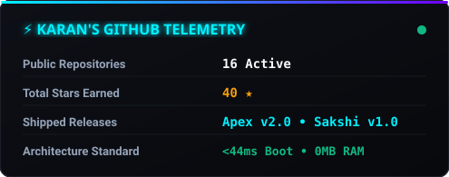
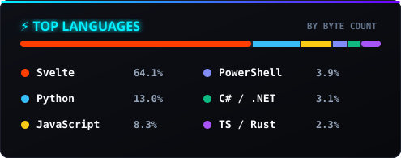

<div align="center">

# <strong><a href="https://git.io/typing-svg"></a></strong>

<strong>
</strong>

# <strong>
</strong>


# <strong><a href="https://git.io/typing-svg"></a></strong>

<br>


<br><br>

<p align="center">
  <a href="https://karansinghverma979.github.io/" target="_blank">
    
  </a>
  <a href="https://g.dev/karansinghverma979" target="_blank">
    
  </a>
  <a href="https://g.dev/karansinghverma979" target="_blank">
    
  </a>
  <a href="mailto:karansinghverma979@gmail.com" target="_blank">
    
  </a>
</p>

### <strong>🤖 ARCHITECT OF DESKTOP APPLICATIONS | ⚙️ SYSTEMS AUTOMATION COMMANDER | 🏭 CNC & VMC SPECIALIST</strong>

<strong>I am a relentless developer, strategist, and builder who enforces absolute control over the physical and digital realms. Grounded in Basic Mechanical Engineering, Advanced Mathematics, and the philosophy of Antaryami (the internal controller), I bring a hyper-disciplined, tactical approach to executing impossible tasks. From hand-coding raw G-Code on industrial CNC/VMC lines to architecting zero-daemon Windows desktop platforms (.NET 9 / Win32) and autonomous AI agent ecosystems via the Model Context Protocol (MCP), my ambition has no ceiling. I do not just learn systems; I dominate them.</strong>

</div>

<br><br>

---

## 🚀 <strong>FLAGSHIP ARTIFACTS & PRODUCTION SYSTEMS (PROOF OF WORK)</strong>

> *"Don't tell me what you know. Show me what you have shipped and what executes at zero idle RAM."*

| Shipped System | Architecture & Engineering Scope | Empirical Benchmarks | Repository & Downloads |
| :--- | :--- | :--- | :--- |
| **Apex Sovereign HUD** | Minimalist AMOLED desktop window manager, topmost pin synchronizer, and destructive process-tree governor. | **&lt;44ms Cold Boot**<br>**0 MB Idle RAM**<br>**DirectX Accelerated** | [`v2.0.0 Release`](https://github.com/karansinghverma979/Sakshi/releases)<br>[Apex Module Source](https://github.com/karansinghverma979/Sakshi/tree/main/Modules/Apex) |
| **Sakshi Platform** | Autonomous hardware-accelerated cognitive supervisor & behavioral governance platform for Windows 11 with WASAPI audio synthesis. | **&lt;38ms Startup**<br>**&lt;5ms Audio Latency**<br>**Decoupled Host** | [`v1.0.0 Release`](https://github.com/karansinghverma979/Sakshi/releases)<br>[Sakshi Source](https://github.com/karansinghverma979/Sakshi) |
| **Repo Architect Plugin** | Autonomous GitHub repository architect, OpenSSF supply chain hardener & dual-audience documentation engine. | **&lt;50ms Secret Scan**<br>**OpenSSF 10/10 Score**<br>**SHA Action Pinning** | [Plugin Source](https://github.com/karansinghverma979/antigravity-repo-architect-plugin) |
| **Play Console MCP Hub** | Production-grade Model Context Protocol server for Google Play Console and Android Developer API v3 automation. | **Automated Staging**<br>**.AAB Fast Deployment**<br>**Track Management** | [MCP Source](https://github.com/karansinghverma979/antigravity-play-console-mcp) |
| **Google Workspace MCP** | Unified Model Context Protocol server equipping autonomous agents with complete CRUD operations across 7 G-Suite services. | **Full CRUD Support**<br>**Calendar, Gmail, Drive**<br>**Docs, Sheets, Tasks** | [MCP Source](https://github.com/karansinghverma979/antigravity-google-workspace-mcp) |
| **Campaigns Tactical OS** | Zero-latency desktop command center & authoritative SQLite state-machine with multi-minister governance. | **ACID SQLite3 Engine**<br>**Obsidian Live Sync**<br>**14 MCP Agent Tools** | [Campaigns Source](https://github.com/karansinghverma979/antigravity-campaigns-mcp) |
| **Blaze-SSH Bridge** | Dual-node Android automation hub & low-latency SSH link connecting Windows 11 with Termux Linux. | **&lt;4ms Local Latency**<br>**Telephony/SMS Relay**<br>**Hardware Sensor Bus** | [Bridge Source](https://github.com/karansinghverma979/Blaze-SSH) |
| **Industrial CNC & VMC** | Hand-crafted G-Code/M-Code toolpaths, kinematic analysis, and multi-axis milling machine design. | **Micron Tolerances**<br>**3-Axis & 5-Axis Milling**<br>**Machine Design** | Physical Precision |

<br>

---

## ⚡ <strong>CURATED TECHNICAL ARSENAL & DISCIPLINES</strong>

<div align="center">

### 🖥️ Low-Level Systems & Native Desktop Architecture


### 🧠 Autonomous AI, MCP Protocols & Tooling


### 🏭 Mechanical Engineering, CNC & VMC Machining


### 📱 Distributed Mesh, Mobile & Shell Infrastructure


</div>

<br>

---

## 📡 <strong>ACTIVE HARDWARE NODES & WORKSTATION MESH</strong>

```text
┌─────────────────────────────────────────────────────────────┐
│ 🖥️ PRIMARY NODE: MOTOBOOK (Developer Workstation)           │
├───────────────────┬─────────────────────────────────────────┤
│ Processor         │ Intel Core 5 210H (12 Cores / 16 Threads)│
│ Display Surface   │ 14" 2.8K 120Hz 10-bit OLED (2880×1800)  │
│ OS & Shell        │ Windows 11 Pro 64-bit • PowerShell 7    │
│ Editor & Prompt   │ Neovim • Starship Tokyo-Night           │
│ Mesh Protocol     │ OpenSSH Port 22 • Zero Background Bloat │
└───────────────────┴─────────────────────────────────────────┘
                              ▲
                              │  OpenSSH Subnet Bridge (<4ms)
                              ▼
┌─────────────────────────────────────────────────────────────┐
│ 📱 SECONDARY NODE: BLAZE (Android Edge Compute Node)        │
├───────────────────┬─────────────────────────────────────────┤
│ Device Platform   │ Lava Blaze 5G (Arm64 Architecture)      │
│ OS & Environment  │ Android 14 • Termux Linux Layer         │
│ Shell & Prompt    │ Zsh • Powerlevel10k                     │
│ Mesh Protocol     │ OpenSSH Port 8022 • Dynamic LAN Mesh    │
│ Telemetry Bus     │ Telephony, Hardware Sensors, Battery    │
└───────────────────┴─────────────────────────────────────────┘
```

<br>

---

## 📊 <strong>GITHUB DOMINATION STATS</strong>

<div align="center">


<br><br>




<br><br>


<br><br><br>

# <strong><a href="https://git.io/typing-svg"></a></strong>

</div>
